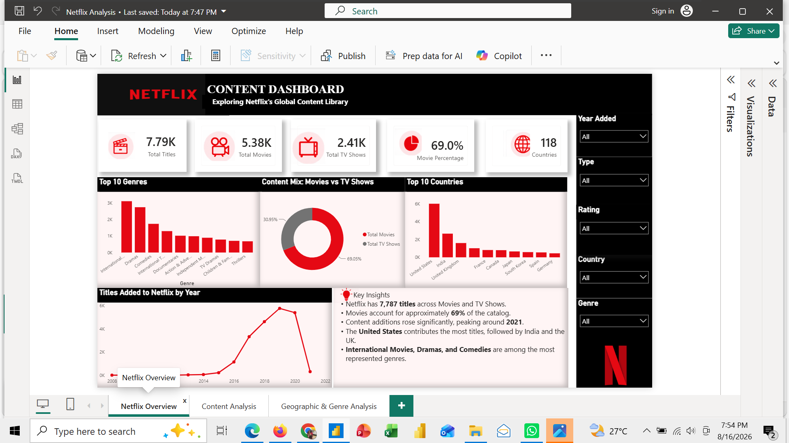
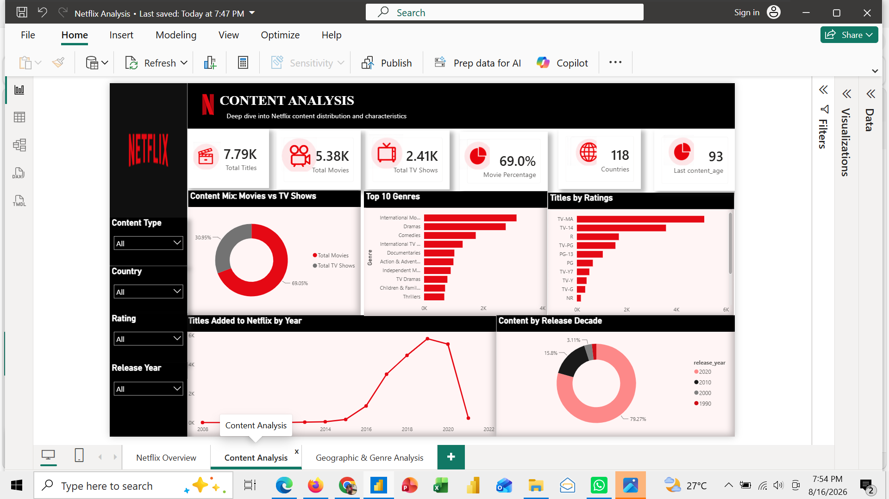
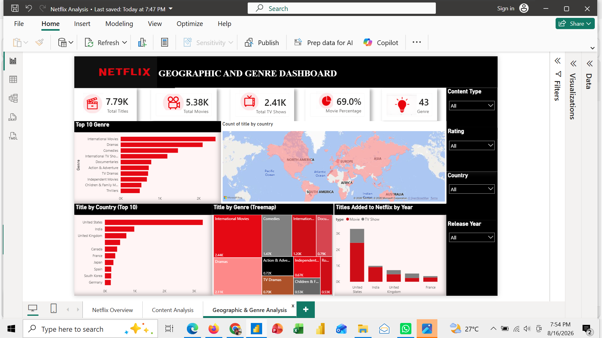

# netflix-power-bi-dashboard
# Netflix Content Analysis Dashboard

## 📊 Project Overview

This project presents an interactive Power BI dashboard designed to analyze Netflix's content library and uncover trends across content type, genres, ratings, release years, and geographic distribution.

The dashboard transforms raw Netflix title data into interactive visual insights that help users understand the composition and evolution of Netflix's content catalogue.

---

## 🎯 Project Objectives

The main objectives of this project were to:

* Analyze the distribution of Movies and TV Shows on Netflix.
* Identify trends in Netflix content releases over time.
* Analyze the most common genres and content categories.
* Examine the geographic distribution of Netflix titles.
* Analyze content ratings and duration.
* Identify the oldest and most recent titles in the dataset.
* Present the findings through an interactive Power BI dashboard.

---

## 🛠️ Tools & Technologies

* **Microsoft Power BI**
* **Power Query**
* **DAX**
* **Microsoft Excel / CSV**
* **Data Visualization**

---

# 📑 Dashboard Pages

## Page 1 — Netflix Overview

The overview page provides a high-level summary of Netflix's content catalogue.

### Key areas analyzed:

* Total number of titles
* Movies vs TV Shows
* Content ratings
* Release-year trends
* Overall content distribution

### Dashboard Preview

---

## Page 2 — Content Analysis

This page focuses on the characteristics and evolution of Netflix content.

### Key areas analyzed:

* Movies vs TV Shows
* Content ratings
* Duration
* Release years
* Oldest title
* Latest title
* Content growth over time

### Dashboard Preview

---

## Page 3 — Geographic & Genre Analysis

This page examines where Netflix content originates and which genres are most represented.

### Key areas analyzed:

* Content by country
* Geographic distribution
* Top genres
* Genre distribution
* Country-level content trends

### Dashboard Preview

---

# 🔎 Key Insights

Some of the major insights identified from the analysis include:

* Movies make up a larger proportion of the Netflix catalogue than TV Shows.
* Netflix experienced significant growth in the number of titles added over time.
* The United States represents one of the largest contributors to Netflix's content catalogue.
* Drama and international content categories are among the prominent genres represented in the dataset.
* The catalogue contains titles spanning several decades, while a significant proportion of titles were released more recently.

---

# 📊 Data Preparation

The dataset was prepared and transformed using Power Query.

The data preparation process included:

* Removing unnecessary columns.
* Handling missing values.
* Cleaning text fields.
* Standardizing categorical values.
* Separating relevant attributes for analysis.
* Creating fields required for visualization.
* Preparing the dataset for Power BI analysis.

---

# 📈 Data Analysis

Power BI was used to create interactive visualizations and analytical measures.

The analysis focused on:

* Content type distribution
* Genre analysis
* Country analysis
* Rating distribution
* Release-year trends
* Content duration
* Historical content trends

---

# 💡 Skills Demonstrated

This project demonstrates practical skills in:

* Data cleaning
* Data transformation
* Exploratory data analysis
* Data visualization
* Dashboard design
* Power Query
* DAX
* Business storytelling
* Analytical insight generation

---

# 📁 Project Files

| File                                               | Description                           |
| -------------------------------------------------- | ------------------------------------- |
| `Netflix_Dashboard.pbix`                           | Power BI dashboard                    |
| `screenshots/page-1-overview.png`                  | Netflix Overview dashboard            |
| `screenshots/page-2-content-analysis.png`          | Content Analysis dashboard            |
| `screenshots/page-3-geographic-genre-analysis.png` | Geographic & Genre Analysis dashboard |

---

# 👩‍💻 Author

**Faithfulness Celestine Nkechi**

Data Analyst | Power BI | Excel | SQL

---

## 📌 Project Purpose

This project was developed as part of my data analytics portfolio to demonstrate my ability to transform raw data into meaningful insights through data preparation, analysis, visualization, and dashboard storytelling.
