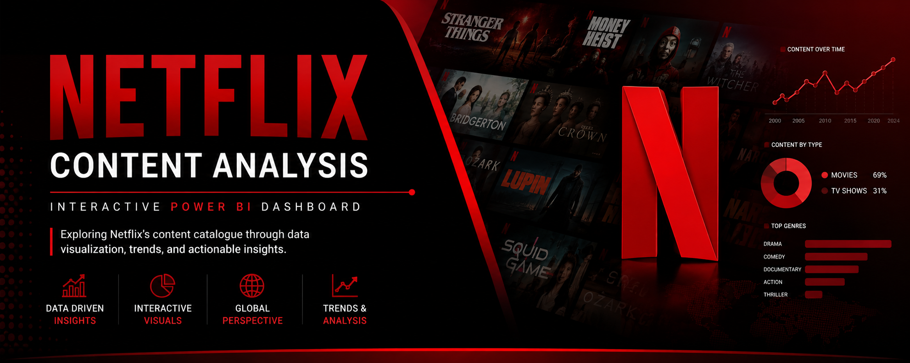

# netflix-power-bi-dashboard
# Netflix Content Analysis Dashboard

  

<h1 align="center">Netflix Content Analysis Dashboard</h1>

  An interactive Power BI dashboard exploring Netflix's content catalogue, genres, ratings, release trends, and geographic distribution.

---

## 📌 Quick Navigation

* [📊 Project Overview](#-project-overview)
* [🎯 Business Questions](#-business-questions)
* [📈 Dashboard](#-dashboard)
* [🔎 Key Insights](#-key-insights)
* [🛠️ Data Preparation](#️-data-preparation)
* [🔄 Analytical Workflow](#-analytical-workflow)
* [💡 Skills Demonstrated](#-skills-demonstrated)
* [📁 Project Files](#-project-files)
* [👩‍💻 About Me](#-about-me)

---

## 📊 Project Overview

This project presents an interactive Power BI dashboard designed to analyze Netflix's content library and uncover trends across content type, genres, ratings, release years, and geographic distribution.

The dashboard transforms raw Netflix title data into interactive visual insights that help users understand the composition and evolution of Netflix's content catalogue.

---

## 🎯 Business Questions

The dashboard was designed to answer the following questions:

* How is Netflix's catalogue distributed between Movies and TV Shows?
* How has Netflix's content library evolved over time?
* Which genres are most represented?
* Which countries contribute the most content?
* What ratings are most common across the catalogue?
* What are the oldest and newest titles in the dataset?
* How does content duration vary across the catalogue?

---

## 📈 Dashboard

### Page 1 — Netflix Overview

The overview page provides a high-level view of Netflix's content catalogue.

---

### Page 2 — Content Analysis

This page explores the characteristics and evolution of Netflix content.

---

### Page 3 — Geographic & Genre Analysis

This page examines the geographic distribution of Netflix titles and the most represented genres.

---

## 🔎 Key Insights

### 1. Content Type

Movies account for a larger proportion of the Netflix catalogue than TV Shows.

### 2. Content Growth

Netflix's catalogue expanded significantly in the more recent years represented in the dataset.

### 3. Geographic Distribution

The United States represents one of the largest contributors to Netflix's content catalogue, alongside substantial international content.

### 4. Genre Distribution

Drama and international content categories feature prominently across the catalogue.

### 5. Content Recency

The dataset contains titles spanning several decades, while a significant share of the catalogue consists of more recent releases.

---

## 🛠️ Data Preparation

The dataset was prepared using Power Query before visualization.

### Data Cleaning

* Removed unnecessary fields
* Handled missing values
* Standardized categorical fields
* Cleaned text columns
* Reviewed inconsistent entries

### Data Transformation

* Separated relevant attributes
* Created analytical fields
* Prepared date-related information
* Structured categorical variables
* Prepared the dataset for Power BI visualization

---

## 🔄 Analytical Workflow

**Raw Dataset**

↓

**Data Cleaning**

↓

**Power Query Transformation**

↓

**Data Modelling**

↓

**DAX Measures**

↓

**Power BI Visualization**

↓

**Insights & Storytelling**

---

## 💡 Skills Demonstrated

* Data Cleaning
* Data Transformation
* Exploratory Data Analysis
* Data Visualization
* Dashboard Design
* Power Query
* DAX
* KPI Development
* Trend Analysis
* Geographic Analysis
* Business Storytelling
* Insight Generation

---

## 💻 Tools & Technologies

| Tool            | Purpose                                             |
| --------------- | --------------------------------------------------- |
| **Power BI**    | Dashboard development and interactive visualization |
| **Power Query** | Data cleaning and transformation                    |
| **DAX**         | Measures and analytical calculations                |
| **Excel / CSV** | Data source and initial data preparation            |

---

## 📁 Project Files

| File                                               | Description                    |
| -------------------------------------------------- | ------------------------------ |
| `Netflix_Dashboard.pbix`                           | Interactive Power BI dashboard |
| `screenshots/netflix-banner.png`                   | Project banner                 |
| `screenshots/page-1-overview.png`                  | Netflix Overview               |
| `screenshots/page-2-content-analysis.png`          | Content Analysis               |
| `screenshots/page-3-geographic-genre-analysis.png` | Geographic & Genre Analysis    |

---

## 👩‍💻 About Me

**Faithfulness Celestine Nkechi**

First-Class Honours graduate in Economics with a strong interest in Data Analytics and Business Intelligence.

I use data analysis and visualization tools to transform raw data into meaningful insights that support better decision-making.

### Core Skills

**Power BI • Excel • SQL • Data Analysis • Data Visualization • Power Query • DAX**

---

  ⭐ Thank you for viewing my project!

